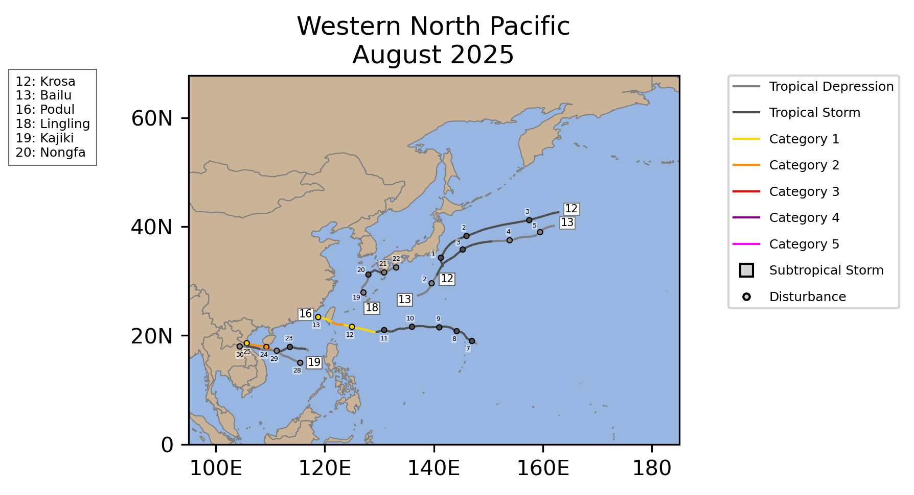

# Load Libraries

```{r}
library(tidyverse)
library(here)
library(climaemet)
library(patchwork)
library(ggplotify)
library(magick)
library(grid)
library(kableExtra)
library(ggmap)
library(ggspatial)
library(ggrepel)
```

# Creating New CSV Files {.hidden .unumbered .unlisted}

Trimming down the tilt meter data to one hour after deployment and one hour before retrieval of the tilt meters.

Making sure all data is captured at one minute intervals.

Note that all data has been adjusted for the Magnetic Declination of -5.85 West within the Domino app.

All data speed units are in cm/s

**This code does not need to be run again!**

```{r}
#| include: false
#| eval: false
#| echo: false
read_csv(here("Data/TiltMeterData/Tilt1_Current.csv")) %>%
 set_names(c("DateTime","Speed","Heading","Velocity_N","Velocity_E")) %>% #Changing the headers int he dataframe
  mutate(DateTime = lubridate::ymd_hms(DateTime)) %>% #Changing the date to character using lubridatde
  filter(between(DateTime, ymd_hms("2025-08-01 11:21:13"), ymd_hms("2025-08-14 08:45:13"))) %>% #Filtering between the dates that we want data from
  write_csv(file ="Data/TiltMeterData/Tilt1_Current.csv") #Creating new CSV File with filtered dates

read_csv(here("Data/TiltMeterData/Tillt2_Current.csv")) %>%
 set_names(c("DateTime","Speed","Heading","Velocity_N","Velocity_E")) %>% 
  mutate(DateTime = lubridate::ymd_hms(DateTime)) %>% 
  filter(between(DateTime, ymd_hms("2025-08-01 13:00:42"), ymd_hms("2025-08-14 09:30:42"))) %>% 
write_csv(file ="Data/TiltMeterData/Tilt2_Current.csv")

read_csv(here("Data/TiltMeterData/Tilt3_Current.csv")) %>%
 set_names(c("DateTime","Speed","Heading","Velocity_N","Velocity_E")) %>% 
  mutate(DateTime = lubridate::ymd_hms(DateTime)) %>% 
  filter(between(DateTime, ymd_hms("2025-08-01 14:45:50"), ymd_hms("2025-08-14T11:30:50"))) %>% 
write_csv(file ="Data/TiltMeterData/Tilt3_Current.csv")

#Tilt 4 was taking data every 20 seconds
read_csv(here("Data/TiltMeterData/Tilt4_Current.csv")) %>%
 set_names(c("DateTime","Speed","Heading","Velocity_N","Velocity_E")) %>% 
  mutate(DateTime = lubridate::ymd_hms(DateTime)) %>% 
  filter(between(DateTime, ymd_hms("2025-08-02 10:45:14"), ymd_hms("2025-08-14 12:45:04"))) %>% 
    group_by(DateTime = floor_date(DateTime, "min")) %>% #Averaging the data over 1 minute to match the other data
   summarise(across(where(is.numeric), mean, na.rm = TRUE),
    .groups = "drop") %>%
write_csv(file ="Data/TiltMeterData/Tilt4_Current.csv")  

read_csv(here("Data/TiltMeterData/Tilt5_Current.csv")) %>%
 set_names(c("DateTime","Speed","Heading","Velocity_N","Velocity_E")) %>% 
  mutate(DateTime = lubridate::ymd_hms(DateTime)) %>% 
  filter(between(DateTime, ymd_hms("2025-08-02 12:18:28"), ymd_hms("2025-08-15 12:30:28"))) %>% 
write_csv(file ="Data/TiltMeterData/Tilt5_Current.csv")

read_csv(here("Data/TiltMeterData/Tilt6_Current.csv")) %>%
 set_names(c("DateTime","Speed","Heading","Velocity_N","Velocity_E")) %>% 
  mutate(DateTime = lubridate::ymd_hms(DateTime)) %>% 
  filter(between(DateTime, ymd_hms("2025-08-02 13:57:00"), ymd_hms("2025-08-15 11:30:00"))) %>% 
write_csv(file ="Data/TiltMeterData/Tilt6_Current.csv")

#Tilt 7 was taking readings every second
read_csv(here("Data/TiltMeterData/Tilt7_Current.csv")) %>%
 set_names(c("DateTime","Speed","Heading","Velocity_N","Velocity_E")) %>% 
  mutate(DateTime = lubridate::ymd_hms(DateTime)) %>% 
  filter(between(DateTime, ymd_hms("2025-08-03 10:32:32"), ymd_hms("2025-08-15 08:46:00"))) %>% 
      group_by(DateTime = floor_date(DateTime, "min")) %>% 
   summarise(across(where(is.numeric), mean, na.rm = TRUE),
    .groups = "drop") %>%
write_csv(file ="Data/TiltMeterData/Tilt7_Current.csv")

#Tilt 8 was taking readings every 20 seconds
read_csv(here("Data/TiltMeterData/Tilt8_Current.csv")) %>%
 set_names(c("DateTime","Speed","Heading","Velocity_N","Velocity_E")) %>% 
  mutate(DateTime = lubridate::ymd_hms(DateTime)) %>% 
  filter(between(DateTime, ymd_hms("2025-08-03 12:06:06"), ymd_hms("2025-08-15 9:47:06"))) %>% 
      group_by(DateTime = floor_date(DateTime, "min")) %>% 
   summarise(across(where(is.numeric), mean, na.rm = TRUE),
    .groups = "drop") %>%
write_csv(file ="Data/TiltMeterData/Tilt8_Current.csv")
```

Temperature Data

```{r}
#| eval: false
#| echo: false
 read_csv(here("Data/TiltMeterData/Tlt1_Temperature.csv")) %>%
 set_names(c("DateTime","Temperature")) %>% #Changing the headers int he dataframe
  mutate(DateTime = lubridate::ymd_hms(DateTime)) %>% #Changing the date to character using lubridatde
  filter(between(DateTime, ymd_hms("2025-08-01 11:21:13"), ymd_hms("2025-08-14 08:45:13"))) %>%  #Filtering between the dates that we want data from
  write_csv(here("Data/TiltMeterData/Tilt1_Temperature.csv")) #Creating new CSV File with filtered dates

 read_csv(here("Data/TiltMeterData/Tilt2_Temperature.csv")) %>%
 set_names(c("DateTime","Temperature")) %>% 
  mutate(DateTime = lubridate::ymd_hms(DateTime)) %>% 
  filter(between(DateTime, ymd_hms("2025-08-01 13:00:42"), ymd_hms("2025-08-14 09:30:42"))) %>% 
write_csv(here("Data/TiltMeterData/Tilt2_Temperature.csv"))
 
 read_csv(here("Data/TiltMeterData/Tilt3_Temperature.csv")) %>%
 set_names(c("DateTime","Temperature")) %>% 
  mutate(DateTime = lubridate::ymd_hms(DateTime)) %>% 
  filter(between(DateTime, ymd_hms("2025-08-01 14:45:50"), ymd_hms("2025-08-14T11:30:50"))) %>% 
write_csv(here("Data/TiltMeterData/Tilt3_Temperature.csv"))
 
 #Tilt 4 was taking data every 20 seconds
read_csv(here("Data/TiltMeterData/Tilt4_Temperature.csv")) %>%
 set_names(c("DateTime","Temperature")) %>% 
  mutate(DateTime = lubridate::ymd_hms(DateTime)) %>% 
  filter(between(DateTime, ymd_hms("2025-08-02 10:45:14"), ymd_hms("2025-08-14 12:45:04"))) %>% 
    group_by(DateTime = floor_date(DateTime, "min")) %>% #Averaging the data over 1 minute to match the other data
   summarise(across(where(is.numeric), mean, na.rm = TRUE),
    .groups = "drop") %>%
write_csv(here("Data/TiltMeterData/Tilt4_Temperature.csv"))
 
read_csv(here("Data/TiltMeterData/Tilt5_Temperature.csv")) %>%
 set_names(c("DateTime","Temperature")) %>% 
  mutate(DateTime = lubridate::ymd_hms(DateTime)) %>% 
  filter(between(DateTime, ymd_hms("2025-08-02 12:18:28"), ymd_hms("2025-08-15 12:30:28"))) %>% 
write_csv(here("Data/TiltMeterData/Tilt5_Temperature.csv"))

read_csv(here("Data/TiltMeterData/Tilt6_Temperature.csv")) %>%
 set_names(c("DateTime","Temperature")) %>% 
  mutate(DateTime = lubridate::ymd_hms(DateTime)) %>% 
  filter(between(DateTime, ymd_hms("2025-08-02 13:57:00"), ymd_hms("2025-08-15 11:30:00"))) %>% 
write_csv(here("Data/TiltMeterData/Tilt6_Temperature.csv"))

#Tilt 7 was taking readings every second
read_csv(here("Data/TiltMeterData/Tilt7_Temperature.csv")) %>%
 set_names(c("DateTime","Temperature")) %>% 
  mutate(DateTime = lubridate::ymd_hms(DateTime)) %>% 
  filter(between(DateTime, ymd_hms("2025-08-03 10:32:32"), ymd_hms("2025-08-15 08:46:00"))) %>% 
      group_by(DateTime = floor_date(DateTime, "min")) %>% 
   summarise(across(where(is.numeric), mean, na.rm = TRUE),
    .groups = "drop") %>%
write_csv(here("Data/TiltMeterData/Tilt7_Temperature.csv"))

#Tilt 8 was taking readings every 20 seconds
read_csv(here("Data/TiltMeterData/Tilt8_Temperature.csv")) %>%
 set_names(c("DateTime","Temperature")) %>% 
  mutate(DateTime = lubridate::ymd_hms(DateTime)) %>% 
  filter(between(DateTime, ymd_hms("2025-08-03 12:06:06"), ymd_hms("2025-08-15 9:47:06"))) %>% 
      group_by(DateTime = floor_date(DateTime, "min")) %>% 
   summarise(across(where(is.numeric), mean, na.rm = TRUE),
    .groups = "drop") %>%
write_csv(here("Data/TiltMeterData/Tilt8_Temperature.csv"))

```

Doing the same for the tide data

Tide data was downloaded from: <https://www.gsi.go.jp/kanshi/tide_data_21_e.html>

```{r}
#| eval: false
#| echo: false
read_table(here("Data/TiltMeterData/21_2021-2025_hour.txt"), col_names = FALSE) %>%
select(-1) %>% #Drops the first column
set_names(c("Date", "Hour", "Sealevel_mm", "DatumConstant_mm", "FixedPointHeight_mm")) %>%
 mutate(Date = lubridate::ymd(Date)) %>% 
  filter(between(Date, ymd("2025-08-01"), ymd("2025-08-15"))) %>%
  
write_csv(here("Data/TiltMeterData/TideData_2025.08.csv"))

```

# Load Data

Most of the tilt meters were set to the *Typical* configuration:

| Configuration | Temperature | Burst Interval | Burst Rate | Burst Duration |
|:--------------|:------------|:---------------|:-----------|:---------------|
| Typical       | 1(min)      | 1(min)         | 8(Hz)      | 20(sec)        |

For those tilt meters that were not configured this way, data was condensed to one minute intervals. All data was trimmed down to one hour after deployment time and one hour before retrieval time.

Note that all data has been adjusted for the Magnetic Declination of -5.85 West within the Domino app.

All data speed units are in cm/s

Tide data was downloaded from the Geospatial Information Authority of Japan [Japan Okinawa Tide Station](https://www.gsi.go.jp/kanshi/tide_data_21_e.html)

```{r}
#| message: false
#| echo: false
#Load Current Data
Tilt1Data <- read_csv(here("Data", "TiltMeterData", "Tilt1_Current.csv"))
Tilt2Data <- read_csv(here("Data", "TiltMeterData", "Tilt2_Current.csv"))
Tilt3Data <- read_csv(here("Data","TiltMeterData", "Tilt3_Current.csv"))
Tilt4Data <- read_csv(here("Data","TiltMeterData","Tilt4_Current.csv"))
Tilt5Data <- read_csv(here("Data","TiltMeterData", "Tilt5_Current.csv"))
Tilt6Data <- read_csv(here("Data","TiltMeterData", "Tilt6_Current.csv"))
Tilt7Data <- read_csv(here("Data","TiltMeterData", "Tilt7_Current.csv"))
Tilt8Data <- read_csv(here("Data","TiltMeterData", "Tilt8_Current.csv"))

#Load Temp Data

Tilt1Temp <- read_csv(here("Data/TiltMeterData/Tilt1_Temperature.csv"))
Tilt2Temp <- read_csv(here("Data/TiltMeterData/Tilt2_Temperature.csv"))
Tilt3Temp <- read_csv(here("Data/TiltMeterData/Tilt3_Temperature.csv"))
Tilt4Temp <- read_csv(here("Data/TiltMeterData/Tilt4_Temperature.csv"))
Tilt5Temp <- read_csv(here("Data/TiltMeterData/Tilt5_Temperature.csv"))
Tilt6Temp <- read_csv(here("Data/TiltMeterData/Tilt6_Temperature.csv"))
Tilt7Temp <- read_csv(here("Data/TiltMeterData/Tilt7_Temperature.csv"))
Tilt8Temp <- read_csv(here("Data/TiltMeterData/Tilt8_Temperature.csv"))

#Load Tide Data

TideData <- read_csv(here("Data/TiltMeterData/TideData_2025.08.csv"))

#Read in Pictures

Tilt1Photo <- image_read(here("Output/TiltMeterData/TiltPhotos/Tilt1jpg.jpg"))
Tilt2Photo <- image_read(here("Output/TiltMeterData/TiltPhotos/Tilt2.jpg"))
Tilt3Photo <- image_read(here("Output/TiltMeterData/TiltPhotos/Tilt3.jpg"))
Tilt4Photo <- image_read(here("Output/TiltMeterData/TiltPhotos/Tilt4.jpg"))
Tilt5Photo <- image_read(here("Output/TiltMeterData/TiltPhotos/Tilt5.jpg"))
Tilt6Photo <- image_read(here("Output/TiltMeterData/TiltPhotos/Tilt6.jpg"))
Tilt7Photo <- image_read(here("Output/TiltMeterData/TiltPhotos/Tilt7.jpg"))
Tilt8Photo <- image_read(here("Output/TiltMeterData/TiltPhotos/Tilt8.jpg"))

#Load Meta Data
TiltMetaData <- read_csv(here("Data/TiltMeterData/MetaData.csv"))
LatLong <- TiltMetaData %>% select(Site, Long, Lat)

```

# Organizing the data

### Tilt Meter Data

Created a function *Tilt_Data_fun* to add a tilt meter name column, separate the data and time into two columns, and add a m/s unit column.

```{r}

#| warning: false
Tilt_Data_fun <- function(df, tilt_name){  #Function to add a tilt name column and separate data and time column 
df %>%
    
separate(col = DateTime, #Choose the column that you want separated
             into = c("Date", "Time"), # Separate it into two columns "Data" and "Time"
             sep = " ", #What are the two separated by 
             remove = FALSE) %>% #Keep the orginial DateTime Column    
    
mutate( #Set datetime,a dding in the UTC timezone so wer are removing taht
       Date = lubridate::ymd(Date), #Set Date
       Time = lubridate::hms(Time), #Set Time
       Speed_m = Speed * 0.01, #Change cm/s -> m/s
       VelocityN_m = Velocity_N * 0.01, #Change cm/s -> m/s
       VelocityE_m = Velocity_E* 0.01, #Change cm/s -> m/s
   
       #Double check that there are no negative headings, can do 360 + negative
       
       TiltMeter = tilt_name) %>%
    
    select(TiltMeter, everything()) #Moving TiltMeter# Column to be the first column
    
}

Tilt1DataClean <- Tilt_Data_fun(Tilt1Data, "Tilt1")
Tilt2DataClean <- Tilt_Data_fun(Tilt2Data, "Tilt2")
Tilt3DataClean <- Tilt_Data_fun(Tilt3Data, "Tilt3")
Tilt4DataClean <- Tilt_Data_fun(Tilt4Data, "Tilt4")
Tilt5DataClean <- Tilt_Data_fun(Tilt5Data, "Tilt5")
Tilt6DataClean <- Tilt_Data_fun(Tilt6Data, "Tilt6")
Tilt7DataClean <- Tilt_Data_fun(Tilt7Data, "Tilt7")
Tilt8DataClean <- Tilt_Data_fun(Tilt8Data, "Tilt8")
```

We then join the data to combine all 8 Tilt Meter, Longitude and Latitude data, and add a *Site* column

```{r}

JoinedData <- rbind(Tilt1DataClean, Tilt2DataClean, Tilt3DataClean, Tilt4DataClean, Tilt5DataClean,  Tilt6DataClean,  Tilt7DataClean, Tilt8DataClean) 

JoinedData <- JoinedData %>% 
  mutate(Site = case_when(
    str_detect(TiltMeter, "Tilt1") ~ "Oki02", 
    str_detect(TiltMeter, "Tilt2") ~ "Oki03", 
    str_detect(TiltMeter, "Tilt3") ~ "Oki04", 
    str_detect(TiltMeter, "Tilt4") ~ "Oki07", 
    str_detect(TiltMeter, "Tilt5") ~ "Oki09", 
    str_detect(TiltMeter, "Tilt6") ~ "Oki11", 
    str_detect(TiltMeter, "Tilt7") ~ "Oki15", 
    str_detect(TiltMeter, "Tilt8") ~ "Oki14" )) %>%
      relocate(Site, .after = TiltMeter) %>%#Move new site column to after the Tilt Meter 
   left_join(LatLong, by = "Site")
```

After we join the data we can view the upper (99.9%) and lower bounds (0.1%) to filter the data

```{r}
#| echo: false
#| results: false

lower_bound <- quantile(JoinedData$Speed, 0.001)
Upper_bound <- quantile(JoinedData$Speed, 0.999)
Upper_bound#Upper bound is 25.01416 we will filter data from this number 

sum(JoinedData$Speed >= .5) #Counting the number of points above .5
# = 5

sum(JoinedData$Speed> 25.01416) #Number of points above the upper bound, 0.25, 145 points

table(cut(JoinedData$Speed_m , seq(0, .25,.05), include.lowest = TRUE)) ##Showing me the different bins and how many data points I have in each one
```

For our time series plots we want to average the speed, heading, Velocity_N, and Velocity_E columns per hour. Filtering out the 99.9% upper bound which is anything above **25.01416** cm/s. We will make new *hourly* data frames. We will do the same for the JoinedData so that we are analyzing everything on an hourly

```{r}
#| echo: false

HourlyTilt_Data_fun <- function(df){  #Function to add a tilt name column and separate data and time column 
 df %>% 
    
    group_by(DateTime = floor_date(DateTime, "hour"), TiltMeter) %>% #New datetime that is rounded to the start of each hour
  summarise(across(where(is.numeric), mean, na.rm = TRUE),
    .groups = "drop") %>%
    filter(Speed <=  25.01416) 
}

Tilt1DataHourly <- HourlyTilt_Data_fun(Tilt1DataClean)
Tilt2DataHourly <- HourlyTilt_Data_fun(Tilt2DataClean)
Tilt3DataHourly <- HourlyTilt_Data_fun(Tilt3DataClean)
Tilt4DataHourly <- HourlyTilt_Data_fun(Tilt4DataClean)
Tilt5DataHourly <- HourlyTilt_Data_fun(Tilt5DataClean)
Tilt6DataHourly <- HourlyTilt_Data_fun(Tilt6DataClean)
Tilt7DataHourly <- HourlyTilt_Data_fun(Tilt7DataClean)
Tilt8DataHourly <- HourlyTilt_Data_fun(Tilt8DataClean)
JoinedDataHourly <- HourlyTilt_Data_fun(JoinedData)
```

### Temperature Data

Created a function *Tilt_Temp_fun* to add a tilt meter name column, and separate the data and time into two columns.

```{r}
#| echo: false
Tilt_Temp_fun <- function(df, tilt_name){ 
df %>%
    
separate(col = DateTime, #Choose the column that you want separated
         into = c("Date", "Time"), # Separate it into two columns "Data" and "Time"
         sep = " ", #What are the two separated by 
         remove = FALSE) %>% #Keep the orginial DateTime Column    
  mutate(DateTime = lubridate::ymd_hms(DateTime), #Set datetime
         Date = lubridate::ymd(Date), #Set Date
         Time = lubridate::hms(Time), 
   TiltMeter = tilt_name, na.rm = TRUE) %>%

    select(TiltMeter, everything()) 
  
}

Tilt1TempData <- Tilt_Temp_fun(Tilt1Temp, "Tilt1")
Tilt2TempData <- Tilt_Temp_fun(Tilt2Temp, "Tilt2")
Tilt3TempData <- Tilt_Temp_fun(Tilt3Temp, "Tilt3")
Tilt4TempData <- Tilt_Temp_fun(Tilt4Temp, "Tilt4")
Tilt5TempData <- Tilt_Temp_fun(Tilt5Temp, "Tilt5")
Tilt6TempData <- Tilt_Temp_fun(Tilt6Temp, "Tilt6")
Tilt7TempData <- Tilt_Temp_fun(Tilt7Temp, "Tilt7")
Tilt8TempData <- Tilt_Temp_fun(Tilt8Temp, "Tilt8")

bad_dates <- Tilt7Temp %>%
  filter(is.na(lubridate::ymd_hms(DateTime)))
bad_dates2 <- Tilt7DataClean %>%
  filter(is.na(lubridate::ymd_hms(DateTime)))
```

Joining all the temperature data together, the lat long data, and creating a *Site* column. We don't make an hourly temperature datframe because we can easily plot this as continuous data.

```{r}
#| echo: false
JoinedTempData <- rbind(Tilt1TempData, Tilt2TempData, Tilt3TempData, Tilt4TempData, Tilt5TempData,  Tilt6TempData,  Tilt7TempData, Tilt8TempData)

JoinedTempData <- JoinedTempData %>% 
  mutate(Site = factor(case_when(
    str_detect(TiltMeter, "Tilt1") ~ "Oki02", 
    str_detect(TiltMeter, "Tilt2") ~ "Oki03", 
    str_detect(TiltMeter, "Tilt3") ~ "Oki04", 
    str_detect(TiltMeter, "Tilt4") ~ "Oki07", 
    str_detect(TiltMeter, "Tilt5") ~ "Oki09", 
    str_detect(TiltMeter, "Tilt6") ~ "Oki11", 
    str_detect(TiltMeter, "Tilt7") ~ "Oki15", 
    str_detect(TiltMeter, "Tilt8") ~ "Oki14" ))) %>%
      relocate(Site, .after = TiltMeter) %>% #Move new site column to after the Tilt Meter
 left_join(LatLong, by = "Site")
```

### Tide Data

Making a new tide dataframe and calling it *TideDataHourly* the tide data is already hourly but we are combing the date and time into one column to match the other dataframes. We are also changing the sealevel from mm to meters in a new column *Sealevel_m*

```{r}
#| echo: false
 TideDataHourly <- TideData %>%
   mutate(DateTime = ymd_hms(paste(Date, Hour, "00:00")), #Combining Date and time into one column 
          Sealevel_m = Sealevel_mm / 1000) %>%
    select(DateTime, everything())

```

# Site Map

Map of the sites, points represent the locations the Tilt Meters were placed.

```{r}
#| fig-width: 12
#| fig-height: 8

MapBound <- c(127.65, 26.3, 128.2, 26.6) #Making a map bounding box, which centers the map better 
#bounding box lowerleftlon, lowerleftlat, upperrightlon, upperrightlat
SiteMap1 <- get_map(location = MapBound, maptype = "hybrid")

SitesMap <- ggmap(SiteMap1) +
  geom_point(data = LatLong, 
            aes(x = Long, y = Lat, color = Site), 
            size = 5) +
  geom_label_repel(data = LatLong, aes(x = Long, y = Lat, label = Site), 
       size = 4) +
   scale_color_manual(
      values = c( "skyblue","orange" ,"green2", "blue","red", "darkred", "magenta", "purple")) +
  #annotate('rect', xmin = 127.73, ymin = 26.45, xmax = 127.75, ymax = 26.46, color = "red", fill = "white")+
# annotate('text', x = 127.75 , y = 26.46, label = 'Oki 15', colour = "white", size = 4)+
# annotate('segment', x = 127.74835, xend = 127.75, y = 26.4377, yend = 26.46,
# color = 'white', arrow = arrow(length = unit (0.3,"cm")), size = 0.75) +

  
labs(x = 'Longitude', y = 'Latitude') + 
  ggtitle('Site Map') +

  annotation_scale( bar_cols = c("lightblue", "white"),
                    location = "br")+ # put the bar on the bottom left and make the colors light blue and white
  
  annotation_north_arrow(location = "tl") + # add a north arrow
  coord_sf(crs = 4326) +
    theme(legend.position = "none", 
          text = element_text(face = "bold", size =12)) 
         
ggsave(here("Output", "TiltMeterData", "SiteMap.png"),
         width = 6, height = 6)
SitesMap
```

# Visualizing Data

```{r}
#| echo: false
#| results: false
#| output: false

ggplot(JoinedData, aes(x = DateTime, y = Speed_m)) +
  geom_point() +
   facet_wrap(~TiltMeter)
```

### Prax Ellipse Function

This code is converted from Matlab Katie Smith Via Christina Comfort.

```{r}
prax_ellipse_fct <- function(u, v) {
  
  N <- length(u)
  
#Remove the mean over time, to leave jut the "pertubations"
  meanu <- mean(u)
  meanv <- mean(v)
  up <- u - meanu
  vp <- v - meanv
  
#This has to do with the mean variance (covariance matrix elements)
  # (1/N) * sum(vector * vector) is equivalent to N * var() but using N
  # Instead of N-1 fo rthe divisor in the variance/covariance calculation 
  # R's var() and cov() use N-1, so we calculate it manually as in Matlab. 
  
  c11 <- (1/N) * sum(up * up)
  c22 <- (1/N) * sum(vp *vp)
  c12 <- (1/N) * sum(up * vp)
  
  # This is the angle to rotate the vecotrs (in radians)
  # R's atan2 is the same as Matlab's
  
   phi <- 0.5 * atan2(2 *c12, c22 - c11) #+ pi/2
  # phi_Deg <- (90 - phi * 180/pi) %% 360
  # major_axis_angle <- phi_Deg
  
  #Eignevalues of a matrix of those values calculated above
  # R's eigen function returns a list with "values" (eigenvalues) and "vectors" (eigenvectors)
  
  cov_matrix <- matrix(c(c11, c12, c12, c22), nrow=2, byrow = TRUE)
  eig_result <- eigen(cov_matrix)

  #Extract eigenvalues
  # The **values** vector in the eig_result is already sorted in decreasing order by 
  lambda1 <- eig_result$values[1] #Major axis variance (largest eigenvalue)
  lambda2 <- eig_result$values[2] # Minor axis variance (smallest eigenvalue)
  
  #Here we turn the eigenvalues (which represetn the variance along the major and minor axes into varaiables which will make tidal ellipses)
  
  a <- sqrt(lambda1) #Major axis semi-length
  b <- sqrt(lambda2) # Minor axis semi-length
  
  #Create the parameter 't"
  
  t <- seq(0, 2 * pi, length.out = 100)
  
  # Calculate the ellipse coordinates (rotated and not centered/mean -subtracted yet)
  #Note: The orginal Matlab script has commented out adding 'meanu' to 'meanv', which would typically center teh ellipse on the mean velocity
  # Matlab's 'phi(1)' is used because 'phi' is an array of size4 1. In R, 'phi' is a scalar
  
  x_base <- a * cos(t)
  y_base <- b * sin(t)
  

  
 # x_rot <- a * cos(t) * cos(pi/2 - phi) - b * sin(t) * sin(pi/2 - phi)
 #y_rot <- a * cos(t) * sin(pi/2 - phi) + b * sin(t) * cos(pi/2 - phi)
  
  # Add the mean back to center the ellipse (if desired, based on the commented out Matlab line)
  # For consistency with the original script's output variable names, we'll use x_rot and y_rot
  # as 'x' and 'y', and include the mean adjustment as an option in the comments.
  # If you want the ellipse centered at the mean velocity:
  # x <- x_rot + meanu
  # y <- y_rot + meanv
   x_rot <- x_base * cos(phi) - y_base * sin(phi)
   y_rot <- x_base * sin(phi) + y_base * cos(phi)
  
  #The function will return the angle phi, and the coordinates x and y 
  return(list(phi = phi, x = x_rot, y = y_rot)) 
  
}

```

## All Sites Current Ellipses

We are again converting the matlab script and we are going to use the joined data to facet plot all the current ellipses together

```{r}
#| output: false

TiltEllipses <- JoinedData %>% 
  group_by(TiltMeter, Site, Long) %>% 
  summarise( 
    ellipse = list({ results <- prax_ellipse_fct(Velocity_N, Velocity_E) 
    
    phi_deg <- (90 - (results$phi * 180 / pi))  #alls us to wrap angles into a 0-360 range
    
    phi_deg <- ifelse(phi_deg > 90, phi_deg - 180, phi_deg)
    
    tibble( x = results$x, y = results$y, phi_deg = phi_deg ) }),
    
    .groups = "drop" ) %>% 
  unnest(ellipse) 

TiltEllipses <- TiltEllipses %>% 
  group_by(TiltMeter) %>%
  mutate(angle_label = round(unique(phi_deg), 1)) 

#Make a table so we can put all the tilt meter data together
# tibble(
#   Site = JoinedData$TiltMeter, 
#   x = results$x, 
#   y = results$y
# )

#Creating a dataframe to plot the ellipse coodinates 
# ellipse_data <- data.frame(x = xx, y = yy)

#Creating gg plot 

AllEllipsesPlot <- ggplot(TiltEllipses, aes( x = x, y = y, color = Site, Lon)) +
  geom_path() + #Have geom label, and have geom point next to it north 
  #facet_wrap(~ paste0(TiltMeter, "\n", angle_label, "˚ cw from north"), scales = "fixed") +
  scale_color_manual(
      values = c( "lightblue","orange" ,"green2", "blue","red", "darkred", "magenta", "purple")) +
  labs(

    x = 'u velocity (cm/s)',
    y = 'v velocity (cm/s)'
  ) +
# Enforce equal scale (axis equal equivalent)
  coord_fixed(ratio = 1) +
# Set the defined limits
  xlim(-7, 7) +
  ylim(-7, 7) +
  
  labs(color = "Site") +
  
  # Apply a clean theme
  theme_bw() +
  theme(
      legend.position = "bottom",
      text = element_text(face = "bold", size =12),
      legend.title = element_text(size = 10), 
      plot.subtitle = element_text(hjust = 1))

# Display the plot
AllEllipsesPlot
#ggsave(here("Output", "TiltMeterData", "CurrentVectors.png"),
        # width = 10, height = 5)

```

```{r}
#| fig-cap: "Current Ellipses and Site Map, colors represent the sites. The larger the ellilpses represent higher flow rates and variability. The sites with the higher flow rates are Oki 7 and Oki 14 while the sites with the lowest flow rates are Oki 2, Oki 3, and Oki11. Our most west site, Oki 15 had the lowest flow rate and variability"
#| fig-width: 12
#| fig-height: 8
 AllEllipsesPlot | SitesMap 

```

## Individual Site Plots

### Current Ellipses

```{r}
TiltEllipses <- JoinedData %>% 
  group_by(TiltMeter, Site, Long) %>% 
  summarise( 
    ellipse = list({ results <- prax_ellipse_fct(Velocity_N, Velocity_E) 
    
    phi_deg <- (90 - (results$phi * 180 / pi))  #alls us to wrap angles into a 0-360 range
    
    phi_deg <- ifelse(phi_deg > 90, phi_deg - 180, phi_deg)
    
    tibble( x = results$x, y = results$y, phi_deg = phi_deg ) }),
    
    .groups = "drop" ) %>% 
  unnest(ellipse) 

TiltEllipses <- TiltEllipses %>% 
  group_by(TiltMeter) %>%
  mutate(angle_label = round(unique(phi_deg), 1)) 
```

```{r}
#| fig-width: 8
#| fig-height: 8
#| fig-cap: "Current ellipses by each site, the degrees clockwise from north represents the ellipse's major axis relative to North"

ggplot(TiltEllipses, aes( x = x, y = y, color = Site, Long)) +
  geom_path() + #Have geom label, and have geom point next to it north 
  facet_wrap(~ paste0(Site, "\n", angle_label, "˚ cw from north"), scales = "fixed") +
  scale_color_manual(
      values = c( "lightblue","orange" ,"green2", "blue","red", "darkred", "magenta", "purple")) +
  labs(

    x = 'u velocity (cm/s)',
    y = 'v velocity (cm/s)'
  ) +
# Enforce equal scale (axis equal equivalent)
  coord_fixed(ratio = 1) +
# Set the defined limits
  xlim(-7, 7) +
  ylim(-7, 7) +
  
  labs(color = "Site") +
  
  # Apply a clean theme
  theme_bw() +
  theme(
      text = element_text(face = "bold", size =12),
      legend.position = "none", 
      plot.subtitle = element_text(hjust = 1))

# Display the plot

ggsave(here("Output", "TiltMeterData", "CurrentVectors.png"),
         width = 6, height = 6)

```

### Flow, Temperature, and Tide Data

The data can be viewed on an interactive map on [GoogleEarth](https://earth.google.com/web/@26.48013127,127.82743887,-0.56086902a,35635.32918753d,30.0006467y,0.00441429h,0.02513031t,0r/data=CgRCAggBMikKJwolCiExdXZGM3BDQ295VHE0WTVFZTlaaURFdXdGamZKX0ZaamggAToDCgEwQgIIAEoHCPWM-SYQAQ)

-   **Feather Plot:** Time series showing the average velocity in cm/s. A positive *Velocity North* (blue) indicates a north flow direction, a negative *Velocity North* (blue) is a south flow direction. A positive *Velocity East* (red) is a east flow direction, a negative *Velocity East* (red) is a west flow direction.

-   **Windrose Plot:** Represents the current speed and direction. The longer the pie cut is in a specific direction is the more dominant current direction. The colors represtent the current speeds in cm/s. The majority current speed at all sites was between 0-5 cm/s.

-   **Temperature Plot:** A line graph showing all temperature. All sites had an increase in temperature around August 5th and a decrease in temperature around August 12th. This may be due to nearby typhoons:

{fig-cap="Tracks of Cyclones near Okinawa in August 2025, the small numbers along the tracks represent the dates when the cyclone was present"} Tracks of Cyclones near Okinawa in August 2025, the small numbers along the tracks represent the dates when the cyclone was present.

**Source:** NOAA National Centers for Environmental Information, Monthly Tropical Cyclones Report for August 2025, published online September 2025, retrieved on November 17, 2025 from [here](https://www.ncei.noaa.gov/access/monitoring/monthly-report/tropical-cyclones/202508). [DOI](https://www.ncei.noaa.gov/access/metadata/landing-page/bin/iso?id=gov.noaa.ncdc:C00775)

-   **Tide Plot:** Continuous line graph of the sealevel in meters that was captured every hour at the Okinawa Tide station.

```{r}
Velocity_TidePlot_fun <- function(Tiltdf, FeatherPlotname, Tempdf, TempPlotname, Tiltdf2, Sitename1, AverageSpeed, WindrosePlotname, TiltPhoto, combinedplot, Sitename, left_sidePlot) {
  
time_limits <- range(Tiltdf$DateTime, na.rm = TRUE)

FeatherPlot <- ggplot(Tiltdf, aes( DatetTime, y = 0)) +
 
  geom_segment(aes( x = DateTime, y = 0, 
                    xend = DateTime, 
                    yend = Velocity_N, #Makes the arrows point up/down
                    color = "Velocity North"), 
               
               lineend = "round" ,
               linewidth = 1,
               alpha = 0.5) +
  
  geom_segment(aes( x = DateTime, y = 0,
                    xend = DateTime, #Makes the arrows lean left/right
                    yend = Velocity_E, #Makes the arrows point up/down
                    color = "Velocity East"), 
               #arrow = arrow(length = unit(0.2, "cm")),
               linewidth = 1, 
               alpha = 0.25) +
  geom_point(aes(x = DateTime, y = Velocity_N), color = "blue4", size = 0.5) +
  geom_point(aes(x = DateTime, y = Velocity_E), color = "coral2", size = 0.5) +
  
  scale_color_manual(name = "Velocity Direction", 
                     values = c("Velocity North" = "blue4", "Velocity East" = "coral2")) +
  
   scale_x_datetime(limits = time_limits, 
                   date_breaks = "2 day", 
                   minor_breaks = "1 day", 
                   date_labels = ("%b %d")) +
 
  labs( x = "Date",
    y = "Velocity (cm/s)") +
  theme_minimal() +
   theme( #legend.position = "inside", #axis.text.x = element_text(angle = 45, hjust =1) +
        #legend.position.inside = c(0.0, 0.1), 
        legend.box.background = element_rect(color = "black"), 
        #legend.key.size = unit(0.1, "cm"), 
           axis.text.x = element_text(angle = 45, hjust =1))
       
 
 ggsave(here("Output","TiltMeterData", "Feather Plots", FeatherPlotname))
 
 
 TempPlot <- ggplot(Tempdf, aes(DateTime, Temperature)) +
  geom_line(color = "pink3") +
    scale_x_datetime(limits = time_limits, 
                   date_breaks = "2 day", 
                   minor_breaks = "1 day", 
                   date_labels = ("%b %d")) +
     labs(y = "Temperature (°C)") + 
   
     theme_minimal() +
   theme( axis.title.x = element_blank(), 
          axis.text.x = element_blank())
          
     
ggsave(here("Output", "TiltMeterData", "Temperature", TempPlotname))
 

TidePlot <- ggplot(TideDataHourly, aes(DateTime, Sealevel_m)) +
   geom_line(color = "steelblue") +
   scale_x_datetime(limits = time_limits, 
                   date_breaks = "2 day", 
                   minor_breaks = "1 day", 
                   date_labels = ("%b %d")) +
  labs( y = "Sealevel (m) ", 
        x = " Date") +
  
  
       theme_minimal() +
      theme( axis.text.x = element_text(angle = 45, hjust =1))
  
   
  
 
 WindrosePlot <- ggwindrose(
    speed = Tiltdf2$Speed, 
    direction = Tiltdf2$Heading,
    n_directions = 8,
    speed_cuts = seq(0, 25, 5), Inf) +
    #stack_revers = TRUE) + #If we want the higher speeds on the outside of the plot
  

    scale_fill_manual(
      values = c( "skyblue","orange" ,"green2", "blue","red", "darkred"),
      drop = FALSE
    ) +

   
      theme_minimal() +
   labs(subtitle = AverageSpeed, fill = "Current Speed\n (cm/s)", 
        title = Sitename1) +
    theme(
      axis.title =  element_blank(),
      text = element_text(face = "bold"),
      legend.title = element_text(size = 9), 
      plot.subtitle = element_text(hjust = 1))
     
  
  ggsave(here("Output","TiltMeterData", "Windrose", WindrosePlotname))
  
 
  TiltPhotoPlot <- wrap_elements(
  panel = rasterGrob(as.raster(TiltPhoto),
                     width = unit(1, "npc"),
                     height = unit(0.5, "npc"))
)

  
 FeatherPlot2 <- FeatherPlot + 
   guides(shape = guide_legend(override.aes = list(size = 0.5)), 
          color = guide_legend(override.aes = list(size = 0.5))) +
   theme(legend.title = element_text(size = 4),
         legend.text = element_text(size = 4), 
         legend.key.size = unit(1, "mm"),       # size of boxes
    legend.key.height = unit(2, "mm"),     # height of each key row
    legend.key.width = unit(1.5, "mm"),      # width of each key column
    legend.spacing.y = unit(0.1, "mm"),    # vertical spacing between keys
    legend.spacing.x = unit(0.1, "mm"),    # horizontal spacing
          legend.box.background = element_rect(color = "black", size = 0.3), 
         axis.title.x =  element_blank(), 
         axis.text.x = element_blank(), 
         axis.ticks.x = element_blank())
         #legend.position = "none")
 
 WindrosePlot2 <- WindrosePlot + theme(plot.title = element_blank())

left_side  <- (FeatherPlot2 / TempPlot / TidePlot) + 
                plot_layout(axes = "collect")

   

right_side <- (WindrosePlot2 / plot_spacer()  / TiltPhotoPlot) 
 

combined <- (left_side | right_side) +
  plot_layout(widths = c(2,1)) +   # control relative widths
  plot_annotation(
    title = Sitename, 
    theme = theme(plot.title = element_text(hjust = 0.5, size = 16))
  ) &
  theme(text = element_text(face = "bold"))
  
   #ggsave(here::here("Output", "TiltMeterData", combinedplot))
   
   
Combined2 <- left_side +
  plot_annotation(
    title = Sitename, 
    theme = theme(plot.title = element_text(hjust = 0.5, size = 16)) 
    
  ) &
  theme(text = element_text(face = "bold"),
        # axis.title.x = element_text(size = 12), 
        axis.title.y = element_text(size = 10))

   ggsave(here::here("Output", "TiltMeterData", left_sidePlot))

   return(combined)
   return(left_side)
 
 }


Velocity_TidePlot_fun(Tilt1DataHourly, FeatherPlotname = "Tilt1Velocity.png", Tilt1Temp, TempPlotname = "Tilt1Temp.png", Tilt1DataHourly, Sitename1 = "Site: Oki 2", AverageSpeed = "Average Speed: 1.74 cm/s", WindrosePlotname = "Windrose1.jpeg", Tilt1Photo, combinedplot = "Tilt1TideCombo.jpeg", Sitename = "Site: Oki 2", left_sidePlot = "Site2VelocityTempTide.jpeg")

 Velocity_TidePlot_fun(Tilt2DataHourly, FeatherPlotname = "Tilt2Velocity.png", Tilt2Temp, TempPlotname = "Tilt2Temp.png", Tilt2DataHourly, Sitename1 = "*Site: Oki 3*", AverageSpeed = "Average Speed: 0.80 cm/s", WindrosePlotname = "Windrose2.jpeg", Tilt2Photo, combinedplot = "Tilt2TideCombo.jpeg", Sitename = "*Site: Oki 3*", left_sidePlot = "Site3VelocityTempTidePlot.jpeg")

 Velocity_TidePlot_fun(Tilt3DataHourly, FeatherPlotname = "Tilt3Velocity.png", Tilt3Temp, TempPlotname = "Tilt3Temp.png", Tilt3DataHourly, Sitename1 = "Site: Oki 4", AverageSpeed = "Average Speed: 3.53 cm/s", WindrosePlotname = "Windrose3.jpeg", Tilt3Photo, combinedplot = "Tilt3TideCombo.jpeg", Sitename = "Site: Oki 4", left_sidePlot = "Site4VelocityTempTidePlot.jpeg")

 Velocity_TidePlot_fun(Tilt4DataHourly, FeatherPlotname = "Tilt4Velocity.png", Tilt4Temp, TempPlotname = "Tilt4Temp.png", Tilt4DataHourly, Sitename1 = "*Site: Oki 7*", AverageSpeed = "Average Speed: 6.27 cm/s", WindrosePlotname = "Windrose4.jpeg", Tilt4Photo, combinedplot = "Tilt4TideCombo.jpeg", Sitename = "*Site: Oki 7*", left_sidePlot = "Site7VelocityTempTidePlot.jpeg")

 Velocity_TidePlot_fun(Tilt5DataHourly, FeatherPlotname = "Tilt5Velocity.png", Tilt5Temp, TempPlotname = "Tilt5Temp.png", Tilt5DataHourly, Sitename1 = "Site: Oki 9", AverageSpeed = "Average Speed: 2.28 cm/s", WindrosePlotname = "Windrose5.jpeg", Tilt5Photo, combinedplot = "Tilt5TideCombo.jpeg", Sitename = "Site: Oki 9", left_sidePlot = "Site9VelocityTempTidePlot.jpeg")

 Velocity_TidePlot_fun(Tilt6DataHourly, FeatherPlotname = "Tilt6Velocity.png", Tilt6Temp, TempPlotname = "Tilt6Temp.png", Tilt6DataHourly, Sitename1 = "*Site: Oki 11*", AverageSpeed = "Average Speed: 0.80 cm/s", WindrosePlotname = "Windrose6.jpeg", Tilt6Photo, combinedplot = "Tilt6TideCombo.jpeg", Sitename = "*Site: Oki 11*", left_sidePlot = "Site11VelocityTempTidePlot.jpeg")

 Velocity_TidePlot_fun(Tilt7DataHourly, FeatherPlotname = "Tilt7Velocity.png", Tilt7Temp, TempPlotname = "Tilt7Temp.png", Tilt7DataHourly, Sitename1 = "Site: Oki 15", AverageSpeed = "Average Speed: 1.45 cm/s", WindrosePlotname = "Windrose7.jpeg", Tilt7Photo, combinedplot = "Tilt7TideCombo.jpeg", Sitename = "Site: Oki 15", left_sidePlot = "Site15VelocityTempTidePlot.jpeg")

 Velocity_TidePlot_fun(Tilt8DataHourly, FeatherPlotname = "Tilt8Velocity.png", Tilt8Temp, TempPlotname = "Tilt8Temp.png", Tilt8DataHourly, Sitename1 = "Site: Oki 14", AverageSpeed = "Average Speed: 5.43 cm/s", WindrosePlotname = "Windrose8.jpeg", Tilt8Photo, combinedplot = "Tilt8TideCombo.jpeg", Sitename = "Site: Oki 14", left_sidePlot = "Site14VelocityTempTidePlot.jpeg")


```

# Summmary Stats

Degrees to compass heading function

```{r}
degrees_to_compass <- function(degrees) {
  # Normalize degrees to be within 0-360
  degrees <- degrees %% 360

  # Define compass directions and their corresponding degree ranges
  directions <- c("N", "NE", "E", "SE", "S", "SW", "W", "NW", "N")
  breaks <- c(0, 22.5, 67.5, 112.5, 157.5, 202.5, 247.5, 292.5, 337.5, 360)

  # Find the correct direction based on the degree value
  # The findInterval function returns the index of the interval containing each element of 'degrees'.
  # We subtract 1 from the index because the 'directions' vector has N at index 1 and 9, but we only need one N.
  # The last break (360) is effectively the same as 0 for N.
  compass_heading <- directions[findInterval(degrees, breaks)]

  return(compass_heading)
}# Define compass directions and their corresponding degree ranges
  directions <- c("N", "NE", "E", "SE", "S", "SW", "W", "NW", "N")
  breaks <- c(0, 22.5, 67.5, 112.5, 157.5, 202.5, 247.5, 292.5, 337.5, 360)
```

```{r}
#| fig-cap: "Table of the minimum, maximum and average current speeds collected by each of the tilt meters by site. All sites had a souther current direction on average. Highlighted rows are the sites we are considering for long-term monitoring."

Means<- JoinedData %>%
  group_by(Site) %>%
  filter(Speed <=  25.01416) %>%
  summarise(MinSpeed = min(Speed, na.rm = TRUE), 
            MaxSpeed = max(Speed, na.rm = TRUE),
            MeanSpeed = mean(Speed, na.rm = TRUE), 
            MeanFlowDir = mean(Heading, na.rm = TRUE) ) %>%
 mutate(AverageDirection = degrees_to_compass(MeanFlowDir)) %>%
  mutate_if(is.numeric, round, 2) %>%
    mutate(MeanFlowDir = paste0(MeanFlowDir, "˚")) %>%
  arrange(Site) #Reorder so that the means are from lowest ot highest speed


   kbl(Means, format = "html", col.names = c("Site", "Min Speed (cm/s)", "Max Speed (cm/s)", "Mean Speed (cm/s)", "Mean Flow Direction ˚", "Mean Direction ")) %>% #Giving the average speed m/s of each tilt meter
  kable_classic() %>%
     kable_styling(full_width = F, position = "center") %>% 
      row_spec(c(2, 4, 6), bold = TRUE, color = "black", background = "lightyellow") #Highlight oki3, 7, 11
```

```{r}
#| fig-cap: "Table of the minimum, maximum, and average temperatures collected by each of the tilt meters by site. All sites had an average temperature of 29˚C and experienced a 3˚C temperature fluctuation within the two weeks during deployment. Highlighted rows are the sites we are considering for long-term monitoring."

TempMeans <- JoinedTempData %>%
  group_by(Site) %>%

  summarise(min(Temperature), max(Temperature), mean(Temperature)) %>%
  mutate_if(is.numeric, round, 2)

kbl(TempMeans, col.names = c("Site", "Min Temperature", "Max Temperature", "Mean Temperature")) %>%
  kable_classic()  %>%
  kable_styling(full_width = FALSE) %>%
  row_spec(c(2, 4, 6), bold = TRUE, color = "black", background = "lightyellow")
```
